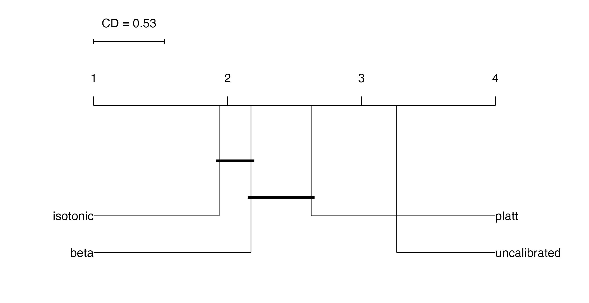
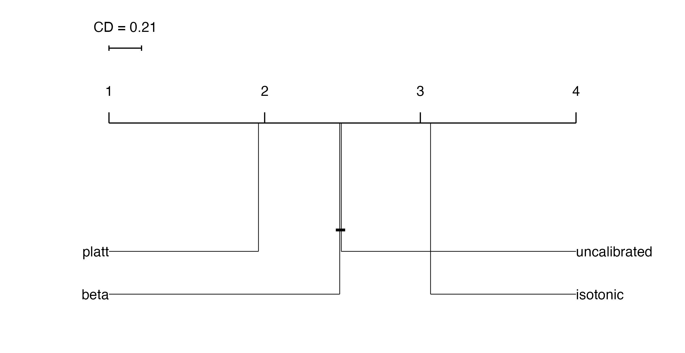

# General Information
This repository contains the corresponding code of the master thesis on the topic ‘Calibration in mlr3 - Implementation and Impact on Model Interpretability’. All experimental setups, registries, evaluation scripts and bmr objects are in the [Experiments](https://github.com/AdriGl117/Mater_Thesis_Calibration/tree/main/experiments) order. All other required functions and R6 classes, e.g. those required for calibration or for the experiments or the visualisation of the results, can be found in the [R](https://github.com/AdriGl117/Mater_Thesis_Calibration/tree/main/R) folder. All graphics that were created in R and are embedded in the thesis can be found in the [figures](https://github.com/AdriGl117/Mater_Thesis_Calibration/tree/main/figures) folder.  The [Sandbox](https://github.com/AdriGl117/Mater_Thesis_Calibration/tree/main/Sandbox) folder contains additional code that are either used to test the implementations or contains older versions of the implementations. This folder therefore does not contain any relevant scripts, but is kept for transparency.

# Implementation 
The implementation of the mlr3 calirbation extension and how to use it can be seen in the following [repository](https://github.com/AdriGl117/mlr3calibration). 

# Hypothesis
1. Cross-validated calibration leads to more robust calibrated predictions than holdout calibration.
2. Parametric calibration techniques are more effective when applied to smaller data sets, whereas non-parametric approaches tend to yield better results when applied to larger data sets.
3. There is no significant difference in model performance whether a pre-tuned learner is calibrated or the entire pipeline is tuned.
4. Calibration leads to a reduction in the deviation of the Partian Dependence Plot of a feature from the ground truth of a feature.

# Experiments 
Three experiments were designed to answer these research questions. The first two research questions by a benchmark experiment testing three calibration approaches, six resampling strategies and eight learners on 10 different tasks. For the third hypothesis, an experiment was set up comparing two different tuning approaches, one tuning before calibration and one tuning around the calibrated learner, for the three calibration approaches, five learners on seven tasks. The last hypothesis, regarding the impact on interpretability, was answered by an experiment in which synthetic data were created in which the influence of the features on the target is known and thus a deviation between partial dependence plots (PDP) and ground truth can be calculated. 

# Results
Only a summary of the results regarding the Brier scores is presented here, the detailed presentation including all measuers and sub categories and the discussion of the results can be found in the thesis.
## Experiment 1

This Critical Difference (CD) plot shows the average ranks of all resampling strategies with regard to the Brier score. These show that the cross validation (CV) and union resampling strategies lead to significantly better results than the holdout strategies. In addition, the five-fold CV strategy shows significantly better results than the union and the three-fold CV strategy. There is no significant difference within the union strategies.

This Critical Difference (CD) plot shows the average ranks of the three calibration approaches with regard to the Brier score. This show that all three apporaches achieve significantly lower average ranks. In addition, the isotonic calibration achieves significantly lower ranks than the Platt scaling. Beta calibration can be found between the  other appraches, but shows no significant differences to either of them.

## Experiment 2

This Critical Difference (CD) plot shows the average ranks of the different tuning approaches with regard to the Brier score. This shows that tuning before calibrating not only saves time, but also achieves better performance.

## Experiment 3

This Critical Difference (CD) plot shows the average ranks of the different tuning approaches with regard to the mse between PDP and ground truth of a feature. This show that the flat scaling achieves a significantly lower mse compared to the uncalibrated model, while the isotonic calibration significantly increases it. Beta calibration does not lead to any significant difference to the uncalibrated model, as the CD is not exceeded. 
