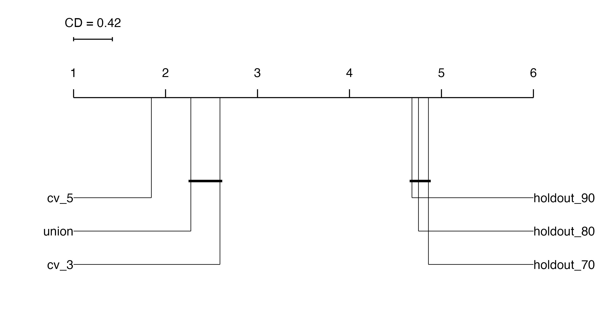

# General Information
This repository contains the corresponding code of the master thesis on the topic ‘Calibration in mlr3 - Implementation and Impact on Model Interpretability’. All experimental setups, registries, evaluation scripts and bmr objects are in the Experiments order. All other required functions and R6 classes, e.g. those required for calibration or for the experiments or the visualisation of the results, can be found in the ‘R’ folder. All graphics that were created in R and are embedded in the thesis can be found in the figures folder.  The Sandbox folder contains additional code that I either used to test the implementations or contains older versions of the implementations. This folder therefore does not contain any relevant scripts, but is used to keep an overview.

# Hypothesis
1. Cross-validated calibration leads to more robust calibrated predictions than holdout calibration.
2. Parametric calibration techniques are more effective when applied to smaller data sets, whereas non-parametric approaches tend to yield better results when applied to larger data sets.
3. There is no significant difference in model performance whether a pre-tuned learner is calibrated or the entire pipeline is tuned.
4. Calibration leads to a reduction in the deviation of the Partian Dependence Plot of a feature from the ground truth of a feature.

# Experiments 
Three experiments were designed to answer these research questions. The first two by  a benchmark experiment testing three calibration approaches, six resampling strategies and eight learners on 10 different tasks. For the third hypothesis, an experiment was set up comparing two different tuning approaches, one tuning before calibration and one tuning around the calibrated learner, for the three calibration approaches, five learners on seven tasks. The last hypothesis, regarding the impact on interpretability, was answered by an experiment in which synthetic data were created in which the influence of the features on the target is known and thus a deviation between partial dependency plots and ground truth can be calculated. 

# Results
## Experiment 1

